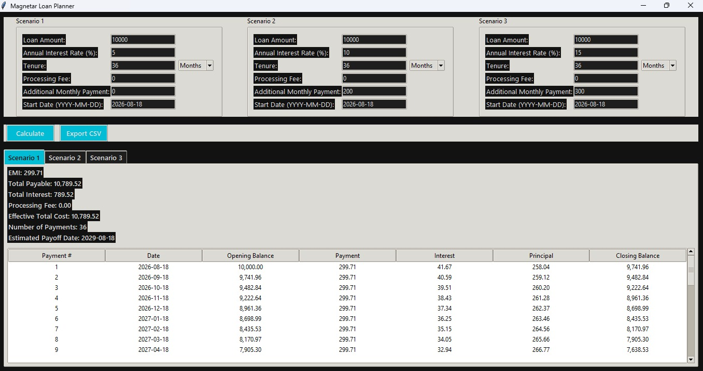
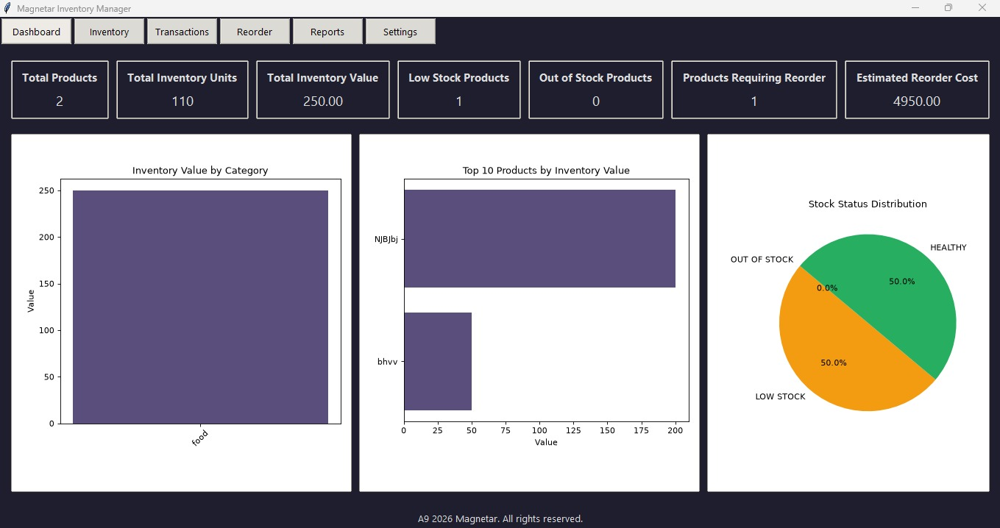
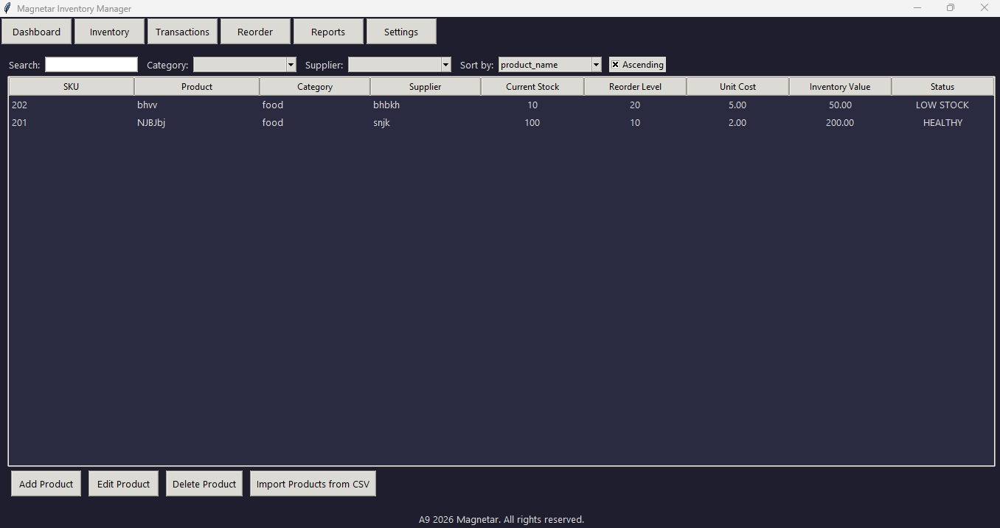
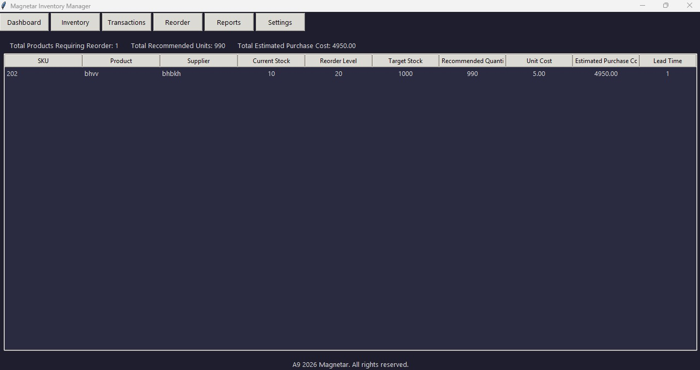
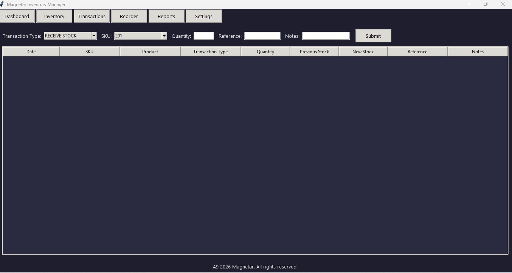
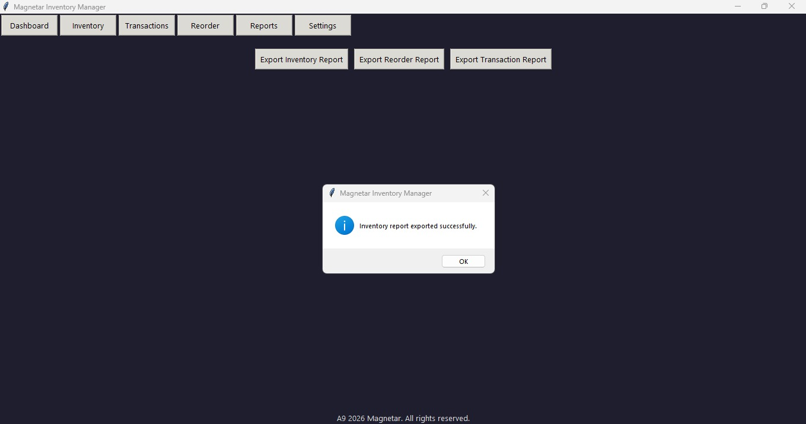
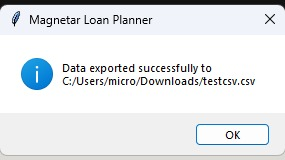
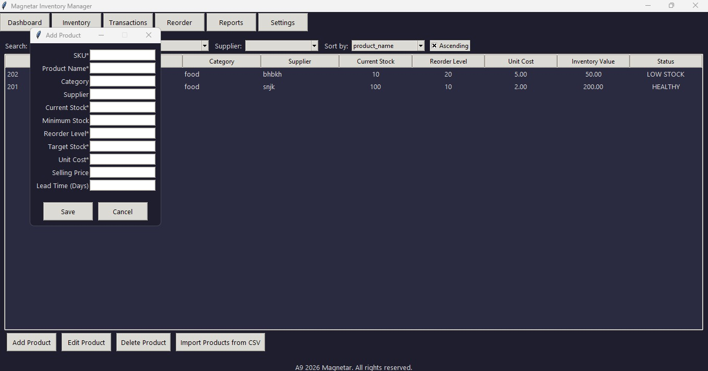
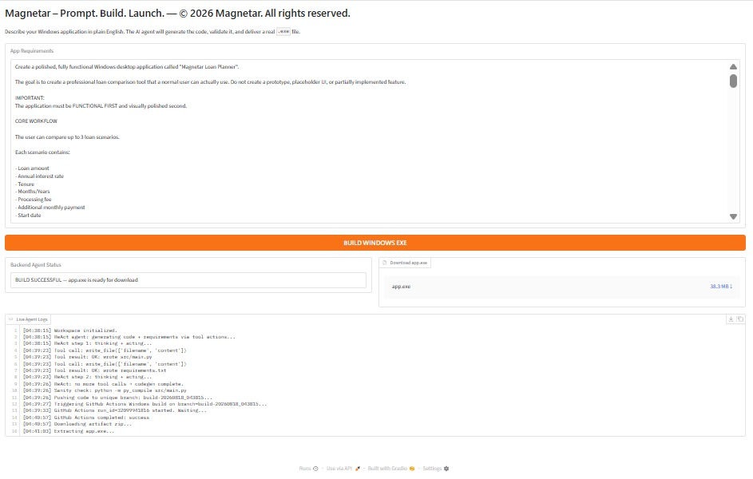

# Build2EXE — Prompt. Build. Launch.

**AI-powered Windows application generation from plain-English requirements**

Build2EXE is an AI-assisted application generation platform that converts a user's natural-language application requirement into a functional Windows `.exe`.

The system combines an AI coding agent, local sanity validation, automated repair, Git-based versioning, a separate GitHub Actions build repository, and artifact delivery into a single workflow.

---

## Table of Contents

- [Overview](#overview)
- [Problem](#problem)
- [Solution](#solution)
- [Core Workflow](#core-workflow)
- [System Architecture](#system-architecture)
- [Technology Stack](#technology-stack)
- [Key Features](#key-features)
- [Validation Applications](#validation-applications)
- [Evidence and Demonstration](#evidence-and-demonstration)
- [Build Pipeline](#build-pipeline)
- [Repository Structure](#repository-structure)
- [Current MVP Scope](#current-mvp-scope)
- [Known Limitations](#known-limitations)
- [Future Roadmap](#future-roadmap)
- [Security and Secrets](#security-and-secrets)
- [How to Run](#how-to-run)
- [Project Context](#project-context)

---

## Overview

Build2EXE addresses a simple problem:

> A user may know what software they want without knowing how to code it.

Instead of requiring the user to install a development environment, write Python code, resolve dependencies, configure PyInstaller, and create a Windows executable manually, Build2EXE accepts a plain-English requirement and automates the majority of this process.

### Product proposition

**Describe → Generate → Validate → Build → Download**

The current MVP focuses on generating Windows desktop applications written in Python and packaging them into a downloadable `.exe`.

---

## Problem

Traditional desktop application development requires users to understand several technical steps:

1. Translate an idea into technical requirements.
2. Write application code.
3. Install and manage dependencies.
4. Debug syntax and implementation errors.
5. Package the application.
6. Configure a Windows build environment.
7. Produce and distribute an executable.

For non-technical users, these steps represent a significant barrier between an idea and a usable application.

Build2EXE attempts to reduce this barrier by providing an AI-driven interface where the primary input is a natural-language description of the desired application.

---

## Solution

Build2EXE uses an **agentic workflow** rather than a single code-generation call.

```text
Plain-English Requirement
          ↓
ReAct Code Generation Agent
          ↓
src/main.py + requirements.txt
          ↓
Compile Sanity Check
          ↓
      PASS / FAIL
       ↙       ↘
     PASS      FAIL
      ↓          ↓
GitHub Build   Patch Agent
      ↑          │
      └──────────┘
          ↓
Unique Git Branch
          ↓
Separate Build Repository
          ↓
GitHub Actions Windows Runner
          ↓
Windows EXE Artifact
          ↓
Downloadable app.exe


The main Build2EXE repository contains the application/orchestration code and demonstration assets. The Windows build workflow is maintained in a **separate repository** and is triggered by Build2EXE when a generated application is ready to compile.

---

## Core Workflow

### 1. User requirement

The user enters a plain-English description of the desired application.

**Example:**

```
Create a desktop loan planner that compares three loan scenarios, calculates EMI and interest, displays an amortization schedule, and exports the results to CSV.
```

### 2. AI code generation

The ReAct-style coding agent generates:

- `src/main.py`
- `requirements.txt`

The model is instructed to produce a complete runnable application rather than a partial prototype.

### 3. Local sanity validation

Before sending the project to the Windows build process, Build2EXE runs:

```bash
python -m py_compile src/main.py
```

This catches basic Python syntax/compilation errors early.

### 4. Automatic repair

If the sanity check fails, the patch agent receives the error information and attempts a repair.

The MVP allows up to **4 patch rounds**.

### 5. Git branch isolation

Each build receives a unique branch:

```
build-YYYYMMDD_HHMMSS
```

This prevents separate generations from interfering with one another.

### 6. Build repository handoff

The generated source is pushed to the configured build repository on the unique branch.

The build repository is separate from the main Build2EXE repository. Its purpose is to provide the Windows GitHub Actions build environment.

### 7. Windows build

The separate build repository triggers its GitHub Actions workflow on the generated branch.

The Windows runner builds:

```
app.exe
```

using PyInstaller.

### 8. Artifact retrieval

The Build2EXE agent waits for the GitHub Actions run to complete, retrieves the `windows-exe` artifact, extracts the executable, and exposes the resulting `app.exe` through the application interface.

---

## System Architecture

```text
┌─────────────────────────────┐
│       User Interface        │
│       Gradio Web UI         │
└──────────────┬──────────────┘
               │
               ▼
┌─────────────────────────────┐
│     ReAct Coding Agent      │
│        GPT-4.1-mini         │
└──────────────┬──────────────┘
               │
        write_file/read_file
               │
               ▼
┌─────────────────────────────┐
│      Generated Project      │
│  src/main.py                │
│  requirements.txt           │
└──────────────┬──────────────┘
               │
               ▼
┌─────────────────────────────┐
│   Compile Sanity Check      │
│   python -m py_compile      │
└──────────────┬──────────────┘
               │
          FAIL │ PASS
               │
               ▼
┌─────────────────────────────┐
│       Patch Agent           │
│      Max 4 rounds           │
└──────────────┬──────────────┘
               │
               ▼
┌─────────────────────────────┐
│       Build Repository      │
│      Unique build branch    │
└──────────────┬──────────────┘
               │
               ▼
┌─────────────────────────────┐
│    GitHub Actions Runner    │
│          Windows            │
└──────────────┬──────────────┘
               │
               ▼
┌─────────────────────────────┐
│       windows-exe           │
│          app.exe            │
└──────────────┬──────────────┘
               │
               ▼
          User Download
```

---

## Technology Stack

| Layer | Technology |
|-------|------------|
| **Language** | Python 3.11+ |
| **AI model** | GPT-4.1-mini |
| **Agent orchestration** | LangGraph |
| **LLM framework** | LangChain / langchain-openai |
| **UI** | Gradio |
| **Validation** | Python `py_compile` |
| **Version control** | Git / GitHub |
| **CI/CD** | GitHub Actions |
| **Windows packaging** | PyInstaller |
| **GitHub integration** | GitHub REST API + Git |
| **Artifact delivery** | GitHub Actions artifacts |

---

## Key Features

- **Natural-language application specification** – Users describe the desired application instead of manually writing source code.
- **Agentic code generation** – The system uses a ReAct-style agent with file-writing and file-reading tools.
- **Automatic compile validation** – Generated Python source is checked before the Windows build.
- **Automatic repair** – Syntax failures can trigger an automated patch cycle.
- **Isolated builds** – Every generation is assigned its own Git branch.
- **Automated Windows packaging** – A separate GitHub repository provides the Windows GitHub Actions build environment.
- **Downloadable executable** – The final artifact is extracted as `app.exe`.
- **Live build status** – The interface exposes build status and live agent logs.

---

## Validation Applications

Two substantial applications were used to validate whether Build2EXE could move beyond simple toy examples.

### 1. Magnetar Loan Planner

The Loan Planner was generated as a functional desktop application for comparing loan scenarios.

#### Core functionality

- Compare up to three loan scenarios
- Loan amount
- Annual interest rate
- Loan tenure
- Months/years selection
- Processing fee
- Additional monthly payment
- Start date
- EMI calculation
- Total payable amount
- Total interest
- Processing cost
- Effective total cost
- Payment schedule
- Estimated payoff date
- CSV export

The application was tested as an actual Windows executable rather than only being inspected as source code.

**Screenshot:**



---

### 2. Magnetar Inventory Manager

The second validation case was a more operational desktop application.

#### Dashboard

The dashboard provides:

- Total products
- Total inventory units
- Total inventory value
- Low-stock products
- Out-of-stock products
- Products requiring reorder
- Estimated reorder cost
- Inventory charts
- Stock status distribution

**Screenshot:**



#### Inventory management

The inventory interface supports:

- Product search
- Category filtering
- Supplier filtering
- Sorting
- Product records
- Current stock
- Reorder levels
- Unit cost
- Inventory value
- Stock status
- Add/edit/delete operations
- CSV import

**Screenshot:**



#### Reordering

The reorder functionality identifies products requiring replenishment and calculates:

- Current stock
- Reorder level
- Target stock
- Recommended quantity
- Unit cost
- Estimated purchase cost
- Lead time

**Screenshot:**



#### Transactions

The transaction interface supports stock movement records, including:

- Receive stock
- SKU
- Quantity
- Reference
- Notes
- Previous stock
- New stock

**Screenshot:**



#### Reports

The reporting section provides export functionality for inventory, reorder, and transaction reports.

**Screenshot (Inventory report export):**



**Screenshot (Downloaded CSV):**



**Screenshot (Inventory addition):**



---

## Evidence and Demonstration

The repository contains screenshots and generated data used to demonstrate the MVP.

### Build2EXE interface

The interface provides a simple natural-language requirement field and a single build action.



### Successful GitHub Actions build

The generated source is pushed to a unique branch in the separate build repository and built on a Windows GitHub Actions runner.


### Generated executable

The resulting executable is returned through the Build2EXE interface.

**Loan Planner:**


**Inventory Manager Dashboard:**


---

## Build Pipeline

```text
User Requirement
       ↓
AI Code Generation
       ↓
src/main.py
requirements.txt
       ↓
py_compile
       ↓
Automatic Repair if Required
       ↓
Unique Git Branch
       ↓
Separate Build Repository
       ↓
GitHub Actions
       ↓
Windows Runner
       ↓
PyInstaller
       ↓
windows-exe artifact
       ↓
Extract app.exe
       ↓
Download
```

### Separation of repositories

The project intentionally uses **two repositories**:

1. **Main Build2EXE repository**
   - Contains:
     - Build2EXE application/orchestration code
     - README and documentation
     - Demonstration screenshots
     - Validation outputs/logs

2. **Separate build repository**
   - Contains the generated application branch during a build and the GitHub Actions workflow responsible for creating the Windows executable.

This separation keeps the application/orchestration repository distinct from the Windows build infrastructure.

---

## Repository Structure

### Main Build2EXE repository

```
Build2EXE-DMDP-IIMA-term6-/
│
├── README.md
├── build2exe.py
│
├── loan_planner.jpeg
├── Generated_Inventory_Manager_executable.jpeg
├── Build2EXE_input_interface.jpeg
├── Successful_GitHub_Actions_Windows_build.jpeg
│
├── product_level_stock_information.jpeg
├── reorder_analysis.jpeg
├── transaction_interface.jpeg
│
├── csv_export_inventory.jpeg
├── csv_downloaded.jpeg
├── inventory_addition.jpeg
│
├── inventoryreport.csv
├── reorderreport.csv
├── testcsv.csv
│
├── logapp1.txt
└── logapp2.txt
```

### Separate Windows build repository

```
Build Repository
│
├── .github/
│   └── workflows/
│       └── build-exe.yml
│
├── src/
│   └── main.py
│
└── requirements.txt
```

The `.github/workflows/build-exe.yml` workflow is **not** part of the main Build2EXE repository. It belongs to the separate build repository used for automated Windows packaging.

---

## Current MVP Scope

The MVP is intentionally focused.

### Current scope

- Plain-English Windows application requirements
- Python application generation
- GPT-4.1-mini coding agent
- File-based code generation
- Compile-level validation
- Automatic syntax repair
- Git branch creation
- Separate Windows build repository
- GitHub Actions build
- Windows executable packaging
- Artifact extraction
- Downloadable `.exe`

### Current product positioning

Build2EXE is not intended to replace a full software engineering team.

It is designed to reduce the technical barrier between:

> "I need this application"

and

> "Here is a Windows executable."

---

## Known Limitations

### 1. Plain-English requirements can be ambiguous

A natural-language request may not contain enough technical detail for an AI coding model to reliably infer every requirement.

This motivates a future **Requirement Specification Agent** between the user and coding agent:

```text
Plain-English Requirement
          ↓
Requirement Specification Agent
          ↓
Structured Technical Specification
          ↓
Coding Agent
```

### 2. Coding-model capability matters

The current MVP uses GPT-4.1-mini because of its economic suitability.

More complex applications may require a stronger coding-oriented model.

### 3. Compile validation is not runtime validation

`py_compile` can detect syntax-level failures, but it cannot prove that:

- every feature works correctly
- calculations are correct
- the UI behaves as intended
- dependencies behave correctly at runtime
- the generated application matches every semantic requirement

Future versions therefore require stronger runtime and functional validation.

### 4. Windows desktop packaging

The current MVP focuses on Windows `.exe` generation.

Cross-platform packaging is a future extension rather than a current MVP capability.

### MVP Validation

The project uses two substantial applications as feasibility demonstrations:

- Loan Planner
- Inventory Manager

These cases demonstrate that the pipeline can generate, package, and execute applications with meaningful functionality.

They should be interpreted as **feasibility evidence**, not as a statistically significant estimate of overall application-generation reliability.

The MVP success benchmark is initially targeted around **60%**, with further testing required to establish a robust production-level success rate.

### Performance

The observed MVP build time is approximately:

**5–6 minutes per successful EXE generation**

The product KPI is:

**Time-to-EXE < 10 minutes**

The observed result is within the current MVP target.

---

## Future Roadmap

### V1 — More reliable requirements

Introduce a dedicated requirement-specification stage:

```text
Plain-English Requirement
        ↓
Specification Agent
        ↓
Structured Specification
        ↓
Coding Agent
        ↓
Validation / Repair
        ↓
Windows EXE
```

This should reduce failures caused by ambiguous user requirements.

### V2 — Stronger application validation

Add:

- runtime smoke tests
- UI validation
- application launch testing
- functional test generation
- automated regression checks
- stronger repair loops

### V3 — Broader platform support

Potential future targets include:

- macOS applications
- Linux applications
- web applications
- mobile applications
- richer deployment targets

---

## Security and Secrets

API credentials are not intended to be stored directly in the source code.

The current implementation retrieves:

- `OPENAI_API_KEY`
- `GITHUB_TOKEN`

from the Google Colab Secrets mechanism.

Before deployment, credentials should remain outside the repository and should never be committed to Git.

### Recommended practice

- Never commit `.env` files containing secrets.
- Never commit API keys.
- Never commit GitHub tokens.
- Rotate credentials immediately if accidentally exposed.
- Restrict GitHub token permissions to the minimum required scope.

---

## How to Run

### Prerequisites

The MVP is designed to run in Google Colab.

Required credentials:

- `OPENAI_API_KEY`
- `GITHUB_TOKEN`

Add these through:

`Google Colab → Runtime → Secrets`

### Install dependencies

```bash
pip install -qU langchain langchain-openai pydantic langgraph gradio requests==2.32.4
```

### Start the application

Run the notebook cells and launch the Gradio interface.

The interface provides:

- An application requirement field.
- A **BUILD WINDOWS EXE** button.
- Backend status.
- Live agent logs.
- A downloadable `app.exe`.

### Example requirement

```
Create a desktop loan planner that compares three loan scenarios,
calculates EMI and total interest, displays an amortization schedule,
and exports the results to CSV.
```

---

## Project Context

- **Project:** Build2EXE
- **Tagline:** Prompt. Build. Launch.
- **Institution:** IIM Ahmedabad
- **Course:** DMDP — Term 6
- **Year:** 2026
- **Organization / Project Brand:** Magnetar

---

## Demonstration Assets

The main repository includes evidence from the MVP validation process:

| Asset | Purpose |
|-------|---------|
| `Build2EXE_input_interface.jpeg` | Build2EXE user interface |
| `Successful_GitHub_Actions_Windows_build.jpeg` | Successful automated Windows build |
| `loan_planner.jpeg` | Loan Planner validation application |
| `Generated_Inventory_Manager_executable.jpeg` | Inventory Manager executable |
| `product_level_stock_information.jpeg` | Inventory management screen |
| `reorder_analysis.jpeg` | Reorder analysis |
| `transaction_interface.jpeg` | Inventory transaction screen |
| `csv_export_inventory.jpeg` | Inventory report export |
| `csv_downloaded.jpeg` | Exported CSV evidence |
| `inventory_addition.jpeg` | Product/inventory addition evidence |
| `inventoryreport.csv` | Generated inventory report |
| `reorderreport.csv` | Generated reorder report |
| `testcsv.csv` | Generated test/export data |
| `logapp1.txt` | Application/build evidence log |
| `logapp2.txt` | Application/build evidence log |

---

## Final Note

Build2EXE is an MVP demonstrating an end-to-end path from natural-language intent to a real Windows executable.

The central product insight is not simply that an AI model can generate Python code. The more important proposition is that code generation, validation, repair, version control, Windows compilation, artifact management, and delivery can be composed into a single user-facing workflow.

That architecture provides the foundation for progressively increasing reliability, application complexity, and platform coverage.

